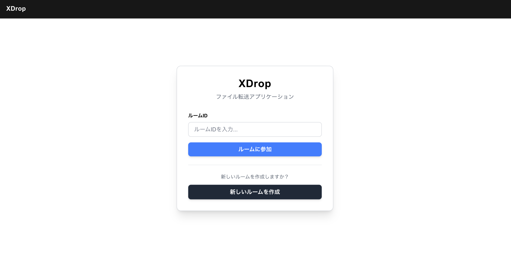
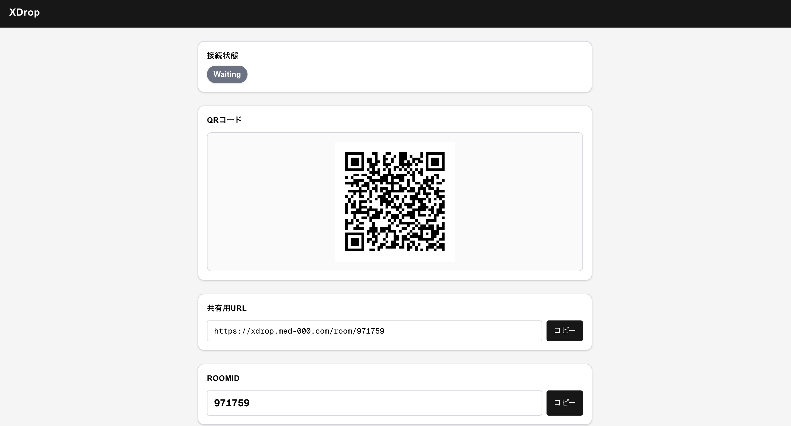
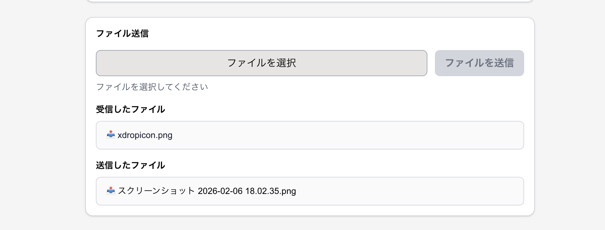
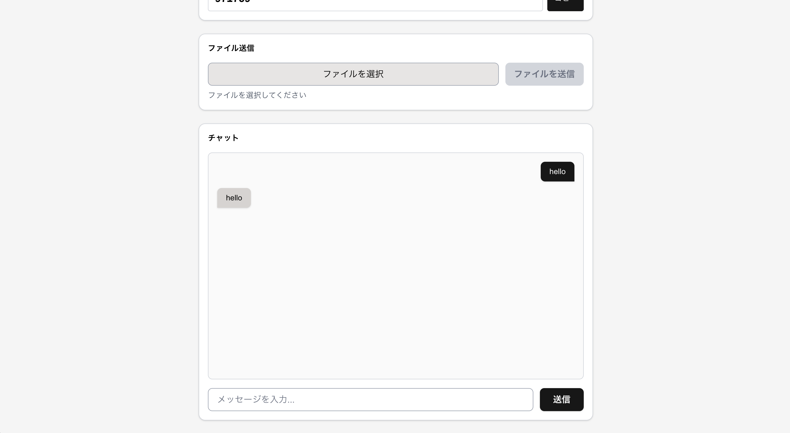

# **XDrop**

WebRTCを用いた、ファイルとテキストを送受信できるWebアプリです。

## **Demo**

- URL: https://xdrop.med-000.com

home


wait room


file send


text message


## **Overview**

- 学校のPCがWindowsのため、Apple製品のAirdropのようにすぐにファイルを送受信できるようなアプリが欲しかったため作成しました。

## **Architecture**

### **Tech Stack**


- Frontend: Next.js(TypeScript)
- Backend: Go (Gin)
- container: Docker
- server: nginx
- Signaling: WebSocket
- P2P通信: WebRTC (STUN)

## **Project Structure**

```
.
├── backend
│   ├── cmd
│   ├── Dockerfile
│   ├── go.mod
│   ├── go.sum
│   └── internal
├── frontend
│   ├── app
│   ├── components
│   ├── Dockerfile
│   ├── eslint.config.mjs
│   ├── lib
├── nginx
│   └── conf.d
├── docker-compose.yml
└── README.md
```

## **Setup**

1. **Clone**
   ```
   git clone https://github.com/med-000/XDrop.git
   cd xdrop
   ```
2. **Run**

   _frontend_

   ```
   cd frontend
   pnpm run dev
   ```

   _backend_

   ```
   cd backend
   go run cmd/main.go
   ```

3. **Access**

   _Frontend:_

   ```
   http://localhost:3000
   ```

   _Backend:_

   ```
   http://localhost:8080
   ```

4. **other**
   **demo runnning**
   _demo server run_
   ```
   cd xdrop
   docker compose up
   ```
   _Access_
   ```
   http://localhost
   ```

## **Usage**

1. ルームを作成
2. URL or QRコードを共有
3. ファイルまたはメッセージを送信

## **Technical Highlights**

- webRTCを用いることによって2者の通信をP2Pに絞ることによってセキュアな通信ができます
- webRTCのシグナリング情報をwebsocketを用いて交換することで、より簡単にシグナリングを交換できます

## **License**

MIT
